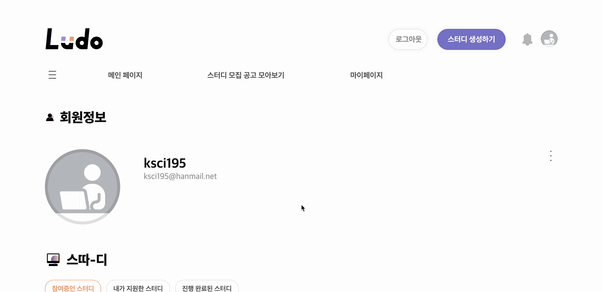

<div align="center">
 
  <h1>나도 배운걸 활용하고 싶다</h1>
  배운걸 활용하고 싶은데 고민이신가요?
  <br/>
  여러 사람들과 체계적으로 스터디를 관리하고 싶으신가요?
  <br/>
  걱정마세요. 당신이 원하는 스터디 Ludo가 찾아드릴게요.
  <br/><br/>
</div>

## 📎 [Ludo 바로가기](https://ludoapi.store/)

## 💡 프로젝트 소개
**스터디 지원부터 참여, 관리까지**<br>
**누구나 쉽고 빠르게 지속 가능한 스터디에 참여할 수 있는 스터디 플랫폼입니다.**

## 🎬 프로젝트 진행상황
### ✔︎ 진행기간 : 2023.12.15 ~ 진행 중
#### ✔︎ 1차 마일스톤 : 2023.12.15 ~ 2024.03.15
#### ✔︎ 1차 유저 테스트 : 2024.3.26 ~ 2024.3.30
#### ✔︎ 2차 마일스톤 : 2024.04.02 ~ 

## 📋 프로젝트 자료
### 🖌 기획
#### 📓 [유저 스토리](https://docs.google.com/spreadsheets/d/14xlWLKUEV8hrthsYjRFmHcRLDtWRKmthFgiiYNGrhwA/edit#gid=0) 
#### 📓 [페이지 Flow Chart](https://www.figma.com/file/aCw6w4LCjTczfRGlmD1bhV/Page-flow-chart?type=whiteboard&node-id=0-1&t=99pRF5UZwzy7u5i5-0) <br>
#### 📓 [브레인 스토밍](https://www.figma.com/file/VSxOLuyKKZobloOcFja93N/Brain-storming?type=whiteboard&node-id=2-94&t=UZ5vevbuqABdPsBq-0)
#### 📓 [IA(정보 구조도)](https://www.figma.com/file/Sho4QHn0XqEptYBBlbf704/Page-Layout?type=design&node-id=206-31&mode=design&t=YTrENpZjUN2rJ4Dj-0)

### 📄 기능 명세
#### 📓 [API 설계서](http://34.82.109.226/swagger-ui/index.html#/)
#### 📓 [페이지 기능명세서](https://docs.google.com/spreadsheets/d/1TejPT93Gi3ztsGqPt5lpAY1UMFvruP80D9pFmkwy1fI/edit?invite=CLS0q4EH#gid=0)

### 🎨 디자인
#### 📓 [페이지 디자인](https://www.figma.com/file/Sho4QHn0XqEptYBBlbf704/Page-Layout?type=design&node-id=281-174&mode=design&t=TeYlIf3mTucRE1I6-0)
#### 📓 [디자인 시스템](https://www.figma.com/file/OLgSF11mOFN5MpcYzpD3N3/Design-System?type=design&node-id=1121-950&mode=design&t=2ZrFmOMMTcunVk5h-0)

## 🛠 주요 기능

### ✔︎ 스터디 모집공고 조회
메인페이지에서 원하는 카테고리의 스터디 모집공고를 확인할 수 있어요.
<details markdown="1">
<summary>메인페이지에서 스터디 조회</summary>
  
</details>

모집공고 모아보기 페이지에서는 필터를 통해 원하는 스터디 모집공고를 확인할 수 있어요.

<details markdown="1">
<summary>모집공고 모아보기 페이지에서 필터링을 통한 스터디 모집공고 조회</summary>
  
</details>

### ✔︎ 스터디 지원
스터디 모집공고 상세 페이지에서 원하는 스터디 모집공고에 지원할 수 있어요.
<details markdown="1">
<summary>스터디 지원</summary>
  
</details>

### ✔︎ 스터디 생성
로그인한 사용자는 스터디 생성페이지에서 스터디를 생성할 수 있어요.
<details markdown="1">
<summary>스터디 생성</summary>
  
</details>

### ✔︎ 스터디 모집공고 생성
생성된 스터디에 대한 모집공고를 생성할 수 있어요.
<details markdown="1">
<summary>스터디 모집공고 생성</summary>
  
</details>

### ✔︎ 마이페이지
마이페이지에서 참여중인 스터디, 지원한 스터디, 진행 완료된 스터디를 확인할 수 있어요.
<details markdown="1">
<summary>마이페이지</summary>
  
</details>
<br>

## Ludo Team
### 💭 팀 마인드셋
1. 사용자를 우선하는 관점에서 프로덕트 만들기
2. 현업 프로세스와 유사한 협업과정 경험
3. 유지가능한 서비스 만들기
4. 기술 역량 향상
5. 실 사용자가 있는 서비스를 개발 및 운영

### 🙋🏻‍♂️ BE 팀원
<table >
  <tbody>
      <td align="center">
        <a href="https://github.com/Hugh-KR">
            
<h3><b>휴</b></h3></a></td>
        <td align="center">
        <a href="https://github.com/june-777">
            
<h3><b>김준기</b></h3></a></td>
        <td align="center">
        <a href="https://github.com/zxcev">
            
<h3><b>빽</b></h3></a></td>
  </tbody>
</table>

<br>

### 🙋🏻‍♂️ FE 팀원
<table >
  <tbody>
        <td align="center">
        <a href="https://github.com/SungHyun627">
            
<h3><b>김성현</b></h3></a></td>
      <td align="center">
        <a href="https://github.com/kmin-jeong">
            
<h3><b>타로</b></h3></a></td>
  </tbody>
</table>

<br>

## Branch Convention

```
main: 최종 배포 (ver 1.0)
dev: 다음 버전 준비 (ver 2.0)
feature/관련 항목: 관련 항목에 대한 기능 구현
```

1. 여러 feature 브랜치가 만들어지고 완료된 경우 develop 브랜치에 PR 남김
2. PR에 대한 코드 리뷰 진행 (컨벤션 준수, 효율성, 개선점 등)
3. 리뷰 통과시 Merge

<br>

## PR Convention

### Format

```
type(Capitalization 적용): subject 관련 label 적용

```

<br>

## Commit Convention

### Format

```
type: subject

body
```

<br>

## Convention Guide

### type

- 하나의 커밋에 여러 타입이 존재하는 경우 상위 우선순위의 타입을 사용한다.
- fix: 버스 픽스
- feat: 새로운 기능 추가
- refactor: 리팩토링 (버그픽스나 기능추가없는 코드변화)
- docs: 문서만 변경
- style: 코드의 의미가 변경 안 되는 경우 (띄어쓰기, 포맷팅, 줄바꿈 등)
- test: 테스트코드 추가/수정
- chore: 빌드 테스트 업데이트, 패키지 매니저를 설정하는 경우 (프로덕션 코드 변경
  X)

<br>

### subject

- 제목은 50글자를 넘지 않도록 한다.
- 개조식 구문 사용
  - 중요하고 핵심적인 요소만 간추려서 (항목별로 나열하듯이) 표현
- 마지막에 특수문자를 넣지 않는다. (마침표, 느낌표, 물음표 등)

<br>

### body (optional)

- 각 라인별로 balled list로 표시한다.
  - 예시) - AA
- 가능하면 한줄당 72자를 넘지 않도록 한다.
- 본문의 양에 구애받지 않고 최대한 상세히 작성
- “어떻게” 보다는 “무엇을" “왜” 변경했는지 설명한다.
